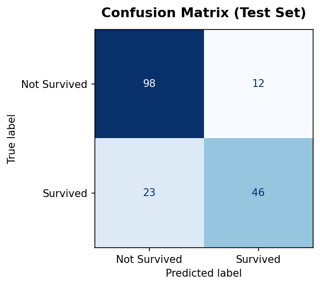
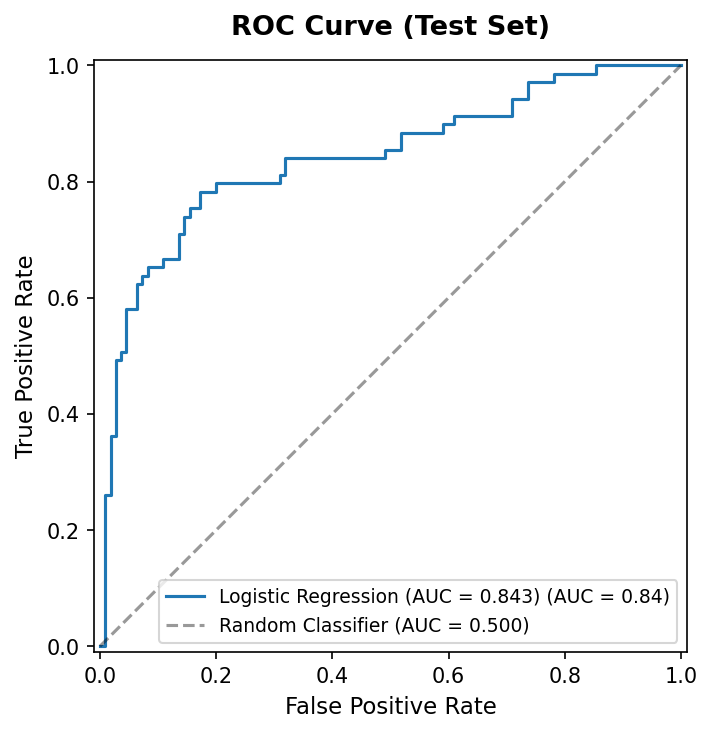

# 🚢 Titanic Survival Prediction – Machine Learning Pipeline  


---

## 📊 Project Preview  

### 🔹 Confusion Matrix  


### 🔹 ROC Curve  


> *(Make sure your images folder contains these files with same names)*

---

## 📈 GitHub Stats  


---

## ⚡ Quick Highlights  
- 📊 Complete ML pipeline using `Pipeline` & `ColumnTransformer`  
- 📉 Evaluated with Accuracy, F1-score, ROC-AUC  
- 🔁 5-Fold Cross Validation implemented  
- 💾 Model saved using Joblib  
- 📁 Clean project structure for real-world use  

---
## 📌 Project Overview  
This project is developed as part of **Task 5 – Data Science with Python Internship**. It focuses on building a **complete end-to-end machine learning pipeline** using the Titanic dataset to predict passenger survival.

The pipeline follows a professional ML workflow, including data preprocessing, model training, evaluation, cross-validation, and model persistence.

---

## 🎯 Objectives  
- Clean and preprocess raw data  
- Build a reproducible ML pipeline  
- Train a Logistic Regression model  
- Evaluate model performance using multiple metrics  
- Apply cross-validation for reliable results  
- Save and reuse the trained model  

---

## 📂 Project Structure  

```
📦 Titanic-ML-Pipeline
├── 📁 data/              # Raw dataset (Titanic CSV file)
├── 📁 model_pipeline/    # Jupyter Notebook and ML pipeline code
├── 📁 images/            # Saved plots (Confusion Matrix, ROC Curve, etc.)
├── model.joblib          # Saved trained model
└── README.md
```

---

## ⚙️ Machine Learning Workflow  

### 1️⃣ Data Preprocessing  
- Target Variable: **Survived**  
- Selected Features:  
  - Pclass, Sex, Age, SibSp, Parch, Fare, Embarked  
- Missing Value Handling:  
  - Numerical → Median Imputation  
  - Categorical → Most Frequent Imputation  
- Encoding: One-Hot Encoding (categorical features)  
- Scaling: StandardScaler for numerical features  

---

### 2️⃣ Model Building  
- Algorithm Used: **Logistic Regression**  
- Pipeline:  
  - `ColumnTransformer` for preprocessing  
  - `Pipeline` for combining preprocessing + model  
- Train-Test Split: 80/20 (Stratified)

---

### 3️⃣ Model Evaluation  
The model is evaluated using:  
- Accuracy  
- Precision, Recall, F1-score  
- Confusion Matrix  
- ROC Curve and ROC-AUC Score  

---

### 4️⃣ Cross-Validation  
- 5-Fold Cross Validation  
- Metric: ROC-AUC  
- Provides more reliable and stable performance estimation  

---

### 5️⃣ Model Persistence  
- Trained pipeline is saved as:  
```
model.joblib
```
- Can be reloaded for future predictions without retraining  

---

## 📊 Results & Insights  
- Logistic Regression provides a strong baseline for binary classification  
- Proper preprocessing significantly improves performance  
- Cross-validation helps reduce overfitting risk  
- Key influencing factors include passenger class, gender, and fare  

---

## 💡 Key Takeaways  
- Building pipelines ensures reproducibility  
- Data preprocessing is as important as model selection  
- Logistic Regression is simple, interpretable, and effective  
- Evaluation using multiple metrics gives better understanding  
- Model saving is essential for real-world deployment  

---

## 🚀 Tools & Technologies  
- Python  
- Pandas  
- NumPy  
- Scikit-learn  
- Matplotlib  
- Joblib  

---

## 📎 Future Improvements  
- Feature Engineering (Family size, Title extraction)  
- Hyperparameter tuning (GridSearchCV)  
- Model comparison (Random Forest, etc.)  
- Handling class imbalance  
- Model explainability  

---

## 📚 References  
- Scikit-learn Documentation  
- Titanic Dataset (Kaggle)  
- Pandas Documentation  

---

## 👨‍💻 Author  
**Aditya Bahira**  
Data Science Enthusiast  
